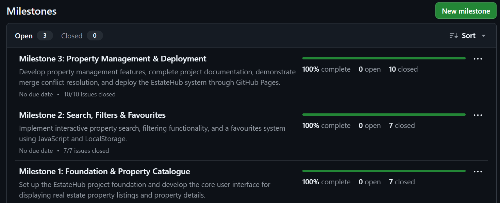
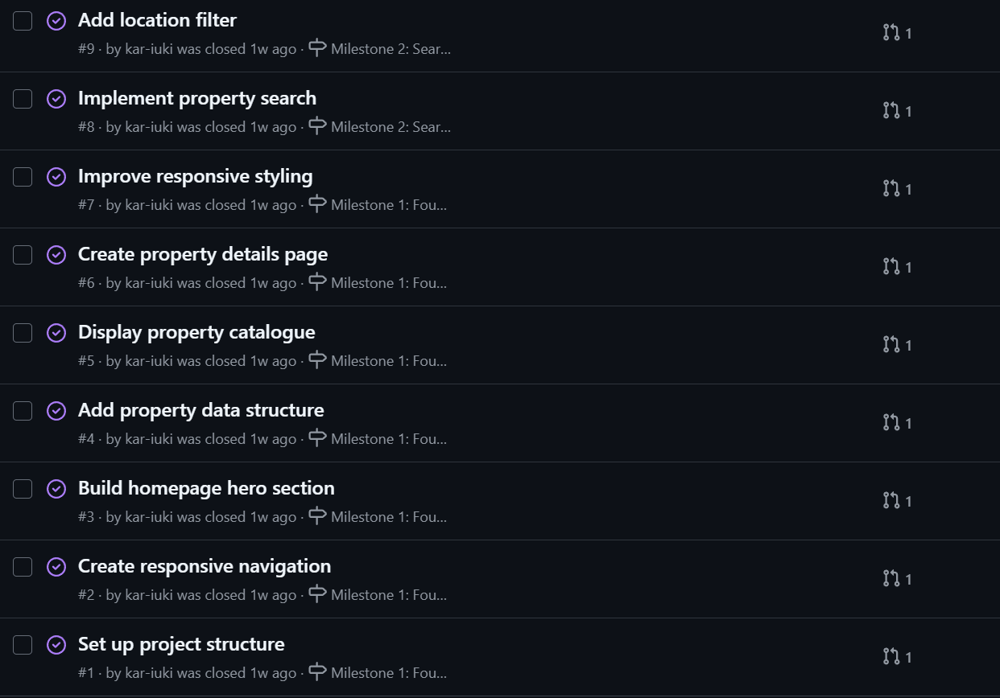
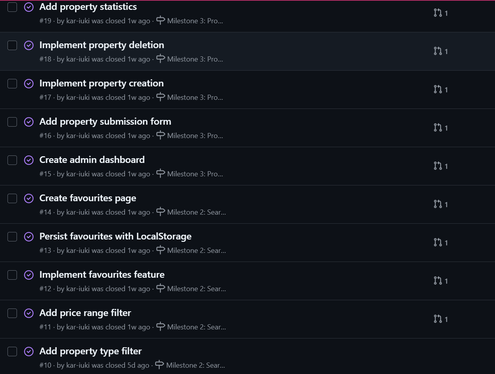
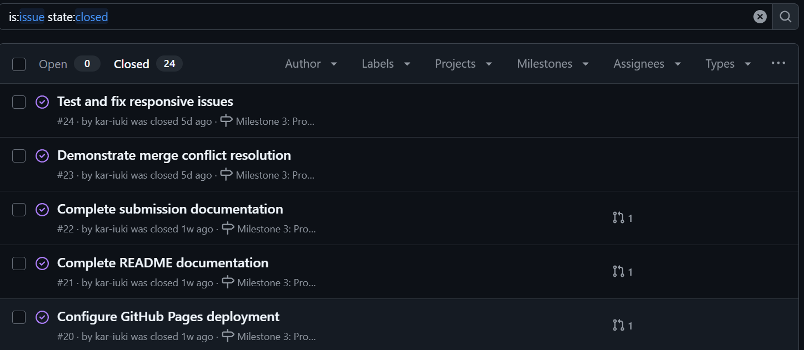
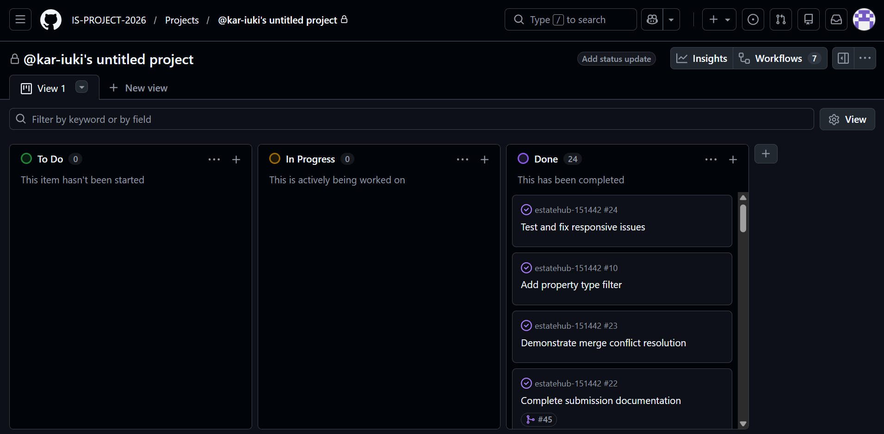
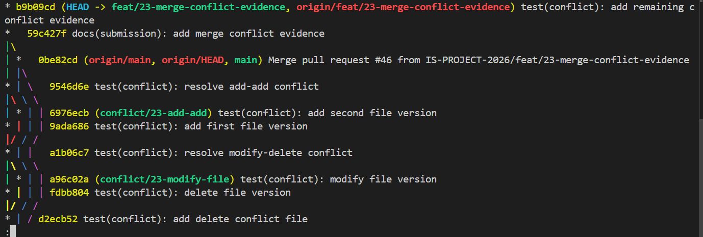
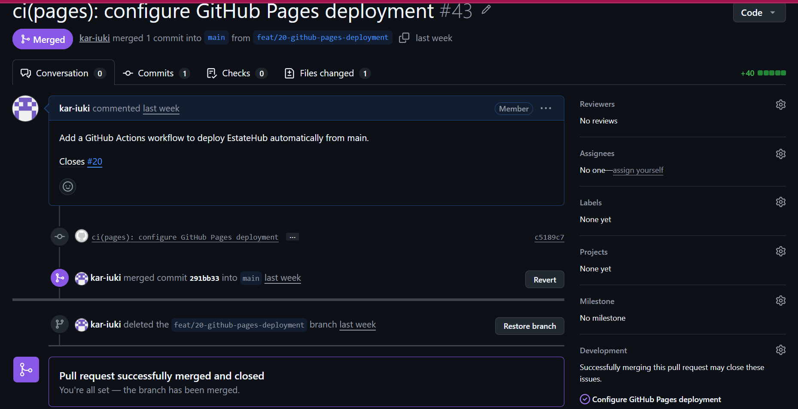

# Project Submission Report

## 1. Student Details

- **Full Name:** Isaac Kariuki Irungu
- **GitHub Username:** kar-iuki
- **Email:** isaac.irungu@strathmore.edu

---

## 2. Deployed Project Link

- **Live GitHub Pages URL:** https://is-project-2026.github.io/estatehub-151442/

---

## 3. Reflection — Grounded in Your Git History

### A. Your Best Commit

- **Commit URL:** https://github.com/IS-PROJECT-2026/estatehub-151442/commit/c5189c7
- **Why this one?** The `ci(pages): configure GitHub Pages deployment` commit uses a clear Conventional Commit type and scope, with a concise description of the CI/CD configuration. It also includes an issue-closing reference linking the implementation back to Issue #20.

### B. A Mistake or Struggle

- **Link to the evidence:** https://github.com/IS-PROJECT-2026/estatehub-151442/pull/26
- **What happened and how did you recover?** During the responsive navigation work, the initial implementation did not apply the expected styling and the mobile menu button did not correctly hide and show the navigation links. I returned to the feature branch, corrected the HTML, CSS, and JavaScript, committed the fixes, and then merged the completed Pull Request.

### C. A Pull Request You're Proud Of

- **PR URL:** https://github.com/IS-PROJECT-2026/estatehub-151442/pull/43
- **What did you check before merging?** I reviewed the workflow file and confirmed that it was configured to deploy from the `main` branch using GitHub Actions. I also checked that the deployment workflow was committed in the correct `.github/workflows/` directory and that the resulting site was publicly accessible.

### D. One Thing You Would Do Differently

- **What would you change?** If I restarted the project, I would delete or clean up merged feature branches earlier instead of allowing many completed branches to remain in the local and remote branch lists. This would make the branch structure easier to navigate and make active work easier to identify.
- **Link to the evidence of the original decision:** https://github.com/IS-PROJECT-2026/estatehub-151442/branches

---

## 4. Screenshots of Key GitHub Features

### A. Milestones and Issues

* **Caption:** The project is organized into three milestones covering the foundation and property catalogue, search and favourites functionality, and property management and deployment, with individual development issues assigned to each milestone.

### B. Project Board

* **Caption:** The GitHub Project Board tracks the EstateHub development workflow using To Do, In Progress, and Done columns, allowing issues to move through the development lifecycle.

### C. Branching Architecture

* **Caption:** The branch list demonstrates issue-linked branch naming using prefixes such as `feat/`, `style/`, and `docs/`, with development work separated from the protected `main` branch.

### D. Pull Requests & Traceability

* **Caption:** This Pull Request demonstrates traceability between a feature branch, its implementation changes, and the GitHub Issue that is automatically closed when the Pull Request is merged.

---

## 5. Merge Conflict Evidence

### Conflict 1 — Full Chronology

**What cause did you use?**

### Both branches modified the same line in `conflict-demo.txt` differently.

#### Step 1: Generating the Clash

The branch `feat/23-merge-conflict-evidence` changed the file to:

EstateHub modern property listing and management system

**Evidence:**  
[View Conflict 1 Evidence](https://github.com/IS-PROJECT-2026/estatehub-151442/blob/feat/23-merge-conflict-evidence/evidence/conflict_evidence_1.png)

* **Caption:** [Git detected a content conflict because both branches modified the same line differently.]

#### Step 2: Inside the Code Editor (Conflict Markers)

**Evidence:**  
[View Conflict 1 Evidence](https://github.com/IS-PROJECT-2026/estatehub-151442/blob/feat/23-merge-conflict-evidence/evidence/conflict_evidence_1.png)

* **Caption:** [The file contained Git conflict markers showing the two competing versions:]

#### Step 3: Resolution & Clean Merge

**Evidence:**  
[View Conflict 1 Evidence](https://github.com/IS-PROJECT-2026/estatehub-151442/tree/main/evidence/conflict_evidence_1.png)

* **Caption:** [The resolved file was staged and committed successfully.]

---

### Conflict 2 — Different Cause

**What cause did you use?** [One branch deleted conflict-delete-demo.txt, while another branch modified the same file.]

**Why does this cause trigger a conflict?** [Git cannot automatically determine whether the file should remain deleted or whether the modified version should be restored.]

**Evidence:**  
[View Conflict 2 Evidence](https://github.com/IS-PROJECT-2026/estatehub-151442/tree/main/evidence/conflict_evidence_2.png)

* **Caption:** [Git detected a modify/delete conflict because HEAD deleted the file while conflict/23-modify-file modified it.]

---

### Conflict 3 — Different Cause

**What cause did you use?** [Both branches independently created a new file named conflict-add-demo.txt with different contents.]

**Why does this cause trigger a conflict?** [Git cannot automatically choose which independently created version of the same file should be kept.]

**Evidence:**  
[View Conflict 3 Evidence](https://github.com/IS-PROJECT-2026/estatehub-151442/tree/main/evidence/conflict_evidence_3.png)

* **Caption:** [Git detected an add/add conflict because both branches added conflict-add-demo.txt with different content.]

---

